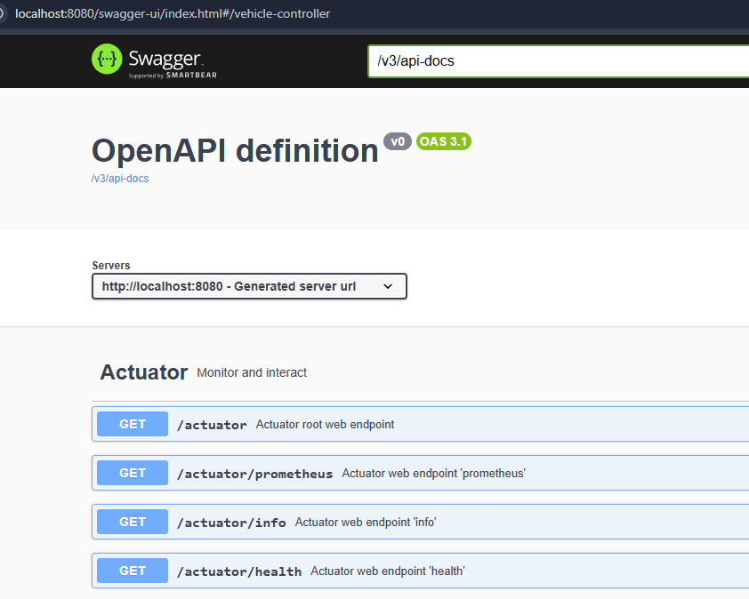
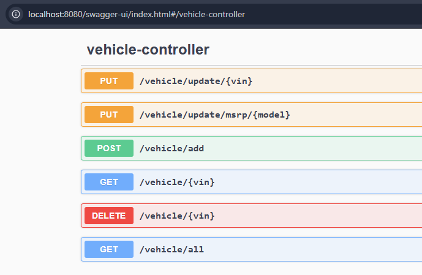
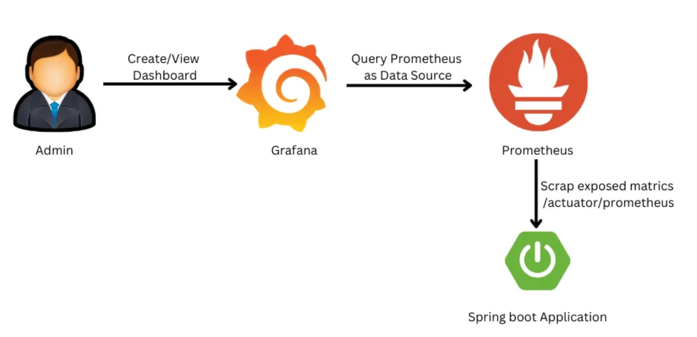
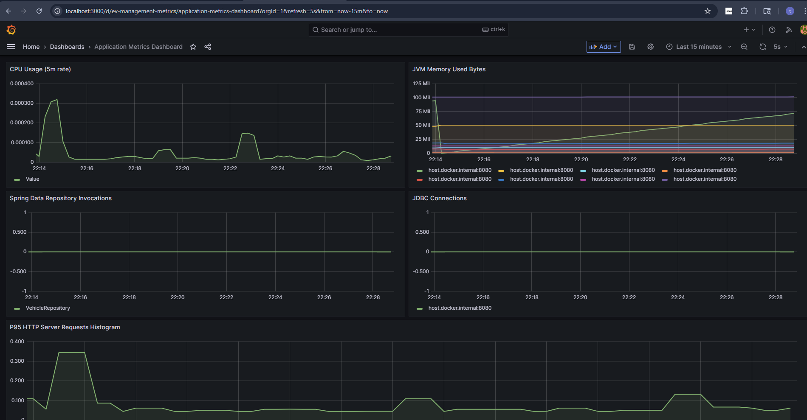

# Documentation

# Prerequisites to run locally
* Java 21 or higher
* Docker runtime and docker compose to run services like prometheus, grafana, postgresql

# DB Schema 

* make run command set's up the postgresql db, prometheus and grafana containers.
  ```
  make all      # start infrastructure, build the app, build Docker image
  make run      # launch the app
  make logs     # stream app logs
  make down     # stop the app container
  make clean    # clean target build + image
  ```
* Do not test the REST endpoints yet
* Open a sql client and connect to this db with the credentials laid out in docker compose file
* run the schema.sql, load ev_staging table manually(gui) and point it to csv file, load-schema.sql from under src/main/resources/db directory
 
# Starting the application
* run `make logs` in a separate terminal to see application logs
* Spring rest docs provide an interface to test the rest endpoints. (rest of the auto generated rest end points can be ignored)
  * http://localhost:8080/swagger-ui/index.html#/vehicle-controller
  * http://localhost:8080/swagger-ui/index.html#/Actuator/scrape
 
* Swagger restdocs for reference
 
  
 
   

* To test the rest points using curl, please follow the below documentation 
   
  [curl rest spec](rest.md)
 
# Observability and Monitoring
* Prometheus to scrape for metrics and grafana for monitoring
* Workflow

  

## Observability
* Prometheus UI:
  ```
  Springboot metrics url 
  http://localhost:8080/actuator/prometheus
  
  or

  Local Prometheus UI
  http://localhost:9090/status
  http://localhost:9090/config
  http://localhost:9090/targets
  http://localhost:9090/service-discovery?search=#EvManagementMetrics
  ```
## Monitoring
* Visualizing key metrics using Grafana. 
  Default credentials admin/admin, skip credential change on prompt
  ``` 
  http://localhost:3000/
  ```
* Below are some of the metrics that are added as visualizations in [grafana dashboard](http://localhost:3000/d/ev-management-metrics/application-metrics-dashboard?orgId=1&refresh=5s&from=now-15m&to=now)
  ```
  process_cpu_usage
  jvm_memory_used_bytes
  spring_data_repository_invocations_seconds_count
  jdbc_connections_active
  http_server_requests_seconds_bucket
  ```
* A sneak peek of the dashboard can be seen below
 
   

# Deploying with Helm Charts
* Presented helm chart components under helmchart directory and includes templates for deployment, service, hpa. 
  No config maps and secrets are used as the config is using application.properties.
* For production systems, config map and secrets(obtained from secret vaults like Hashicorp Vault either from application or using GitOps) are to be configured
*  With properly configured kube-context(or a k8s cluster like minikube) and provisioned container registry, application can be deployed with below command.
  ```
  helm upgrade --install ev-management ./helmchart 
  ```

# TODO
* Integration tests
* Maintaining container registry and using suggested docker registry
* helm chart deployment
 
# Limitations
* VIN data is not unique in spreadsheet or unable to get the full context of EV population data.
  Same VIN is associated with multiple locations
  Vehicle to Utility mapping in load schema may need fixing
  Endpoints that provide vehicle details may show inconsistent utility data for a vehicle

