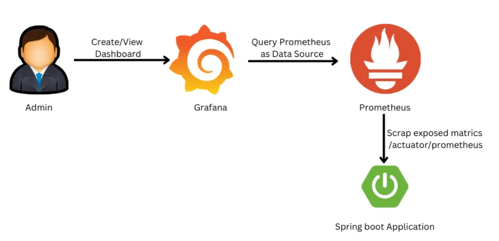
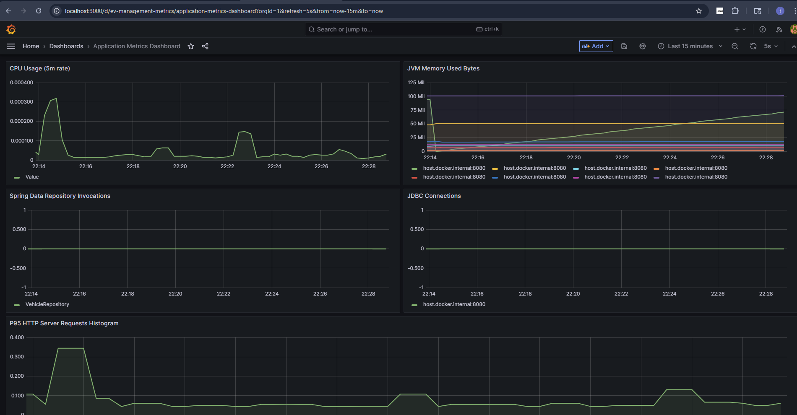

# Documentation

# Local setup requirements
* Java 21 or higher
* Docker runtime
* IDE to run spring boot application

# DB Schema 
* sql scripts are located at /src/main/resources/db
* These scripts are to be run on postgresql server along with the csv file from https://data.wa.gov/api/views/f6w7-q2d2/rows.csv?accessType=DOWNLOAD
* Need to update the path of the file on load-schema-staging-table.sql first when that script is to be run
* Run these commands to prepopulate data from the csv file
```
psql -U ev_management_user -d ev_management -f schema.sql
psql -U ev_management_user -d ev_management -f load-schema-staging-table.sql
psql -U ev_management_user -d ev_management -f load-schema.sql
```
# Setting up DB locally
* Running `docker compose up` at root of the repo will provision docker containers for postgres, grafana, prometheus to be used locally
* Open a sql client and connect to this db with the credentials laid out in docker compose file
* run the schema.sql, load ev_staging table manually(gui) and point it to csv file, load-schema.sql from under src/main/resources/db directory
 
# Application
* Run the spring boot application in an IDE of your choice
* Please follow the below documentation on rest endpoints
  * [REST ENDPOINTS](rest.md)
* Alternatively spring rest docs can be utilized her(ignore the rest of the auto generated rest end points)
  * http://localhost:8080/swagger-ui/index.html#/vehicle-controller
 
# Observability and Monitoring
* Prometheus to scrape for metrics and grafana for monitoring
* Workflow

  

## Observability
* Prometheus UI:
  ```
  http://localhost:8080/swagger-ui/index.html#/Actuator/scrape
  or
  http://localhost:9090/status
  http://localhost:9090/config
  http://localhost:9090/targets
  http://localhost:9090/service-discovery?search=#EvManagementMetrics
  Prometheus metrics end point: http://localhost:8080/actuator/prometheus
  ```
## Monitoring
* Visualizing key metrics using Grafana. 
  Default credentials admin/admin, skip credential change on prompt
  ``` 
  http://localhost:3000/
  ```
* Below are some of the metrics that can be added as visualizations in graphana dashboard 
```
process_cpu_usage
jvm_memory_used_bytes
spring_data_repository_invocations_seconds_count
jdbc_connections_active
http_server_requests_seconds_bucket
```
* A dashboard is provisioned [here](http://localhost:3000/d/ev-management-metrics/application-metrics-dashboard?orgId=1&refresh=5s&from=now-15m&to=now)
  A sneak peek of the dashboard.
 
 


# Deploying with Helm Charts
* Presented helm chart components under helmchart directory and includes templates for deployment, service, hpa. 
  No config maps and secrets as the config is using application.properties.
  With properly configured kube-context and provisioned container registry application can be deployed with below command.
```
helm upgrade --install ev-management ./helmchart 
```

# TODO
* Integration tests
* Fixing Makefile and Dockerfile
* Maintaining container registry and using suggested docker registry
* helm chart deployment
 
# Limitations
* VIN data is not unique in spreadsheet or unable to get the full context of EV population data.
  Same VIN is associated with multiple locations 
  Vehicle to Utility mapping in load schema needs to be fixed because of this issue
  Endpoints that provide vehicle details may show inconsistent utility data for a vehicle

